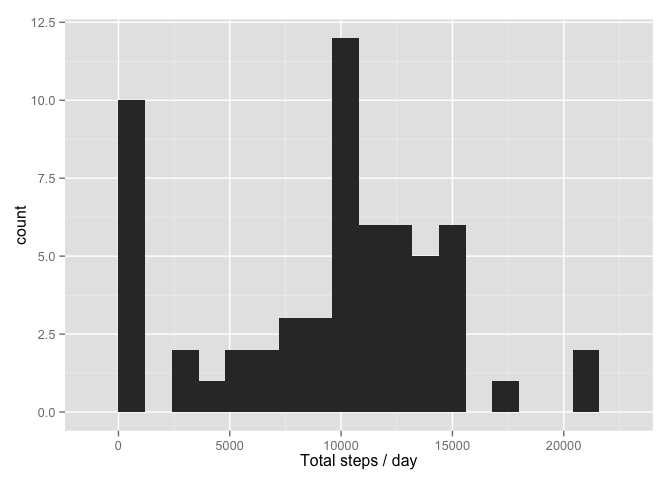

Reproducible Research: Peer Assessment 1
========================================

## Loading and preprocessing the data


```r
library(ggplot2)

unzip("activity.zip")

data <- read.csv("activity.csv")

summary(data)
```

```
##      steps                date          interval     
##  Min.   :  0.00   2012-10-01:  288   Min.   :   0.0  
##  1st Qu.:  0.00   2012-10-02:  288   1st Qu.: 588.8  
##  Median :  0.00   2012-10-03:  288   Median :1177.5  
##  Mean   : 37.38   2012-10-04:  288   Mean   :1177.5  
##  3rd Qu.: 12.00   2012-10-05:  288   3rd Qu.:1766.2  
##  Max.   :806.00   2012-10-06:  288   Max.   :2355.0  
##  NA's   :2304     (Other)   :15840
```


## What is the mean total number of steps taken per day?

1. Make a histogram of the total number of steps taken each day


```r
total.steps <- tapply(data$steps, 
                      data$date, 
                      FUN = sum, 
                      na.rm = TRUE)

qplot(total.steps, 
      binwidth = 1200, 
      xlab="Total steps / day")
```

 

2. Calculate and report the **mean** and **median** total number of
   steps taken per day


```r
mean(total.steps)
```

```
## [1] 9354.23
```


```r
median(total.steps)
```

```
## [1] 10395
```


## What is the average daily activity pattern?

1. Make a time series plot (i.e. `type = "l"`) of the 5-minute
   interval (x-axis) and the average number of steps taken, averaged
   across all days (y-axis)


```r
averages <- aggregate(x=list(steps=data$steps), 
                      by = list(interval=data$interval),
                      FUN = mean, 
                      na.rm = TRUE)

ggplot(data=averages, aes(x=interval, y=steps)) +
    geom_line() +
    xlab("5-minute interval") +
    ylab("Average steps")
```

 


2. Which 5-minute interval, on average across all the days in the
   dataset, contains the maximum number of steps?


```r
averages[which.max(averages$steps),]
```

```
##     interval    steps
## 104      835 206.1698
```

## Imputing missing values

1. Calculate and report the total number of missing values in the
   dataset (i.e. the total number of rows with `NA`s)


```r
missing <- is.na(data$steps)
# How many missing
table(missing)
```

```
## missing
## FALSE  TRUE 
## 15264  2304
```

2. Devise a strategy for filling in all of the missing values in the
   dataset. The strategy does not need to be sophisticated. For
   example, you could use the mean/median for that day, or the mean
   for that 5-minute interval, etc.

I will use the means for the 5-minute intervals as fillers for missing
values.


```r
# Replace each missing value with the mean value of its 5-minute interval
fill.value <- function(steps, interval) {
    filled <- NA
    if (!is.na(steps))
        filled <- c(steps)
    else
        filled <- (averages[averages$interval==interval, "steps"])
    return(filled)
}
```

3. Create a new dataset that is equal to the original dataset but with
   the missing data filled in.


```r
filled.data <- data

filled.data$steps <- mapply(fill.value, 
                            filled.data$steps, 
                            filled.data$interval)

total.steps <- tapply(filled.data$steps, 
                      filled.data$date, 
                      FUN = sum)
```

4. Make a histogram of the total number of steps taken each day and
   Calculate and report the **mean** and **median** total number of
   steps taken per day. Do these values differ from the estimates from
   the first part of the assignment? What is the impact of imputing
   missing data on the estimates of the total daily number of steps?


```r
qplot(total.steps, 
      binwidth = 1200, 
      xlab = "Total steps / day")
```

 

```r
mean(total.steps)
```

```
## [1] 10766.19
```

```r
median(total.steps)
```

```
## [1] 10766.19
```


The impact of the missing data seems rather low, at least when
estimating the total number of steps per day.

## Are there differences in activity patterns between weekdays and weekends?

1. Create a new factor variable in the dataset with two levels --
   "weekday" and "weekend" indicating whether a given date is a
   weekday or weekend day.


```r
weekdayweekend <- function(date) {
    day <- weekdays(date)
    if (day %in% c("Monday", 
                   "Tuesday", 
                   "Wednesday", 
                   "Thursday", 
                   "Friday"))
        return("weekday")
    else if (day %in% c("Saturday", 
                        "Sunday"))
        return("weekend")
    else
        stop("invalid date")}

filled.data$date <- as.Date(filled.data$date)

filled.data$day <- sapply(filled.data$date, 
                          FUN=weekdayweekend)
```

2. Make a panel plot containing a time series plot (i.e. `type = "l"`)
   of the 5-minute interval (x-axis) and the average number of steps
   taken, averaged across all weekday days or weekend days
   (y-axis).
   

```r
averages <- aggregate(steps ~ interval + day, 
                      data=filled.data, 
                      mean)

ggplot(averages, aes(interval, steps)) + 
        geom_line() + facet_grid(day ~ .) +
        xlab("5-minute interval") +
        ylab("Steps")
```

 
